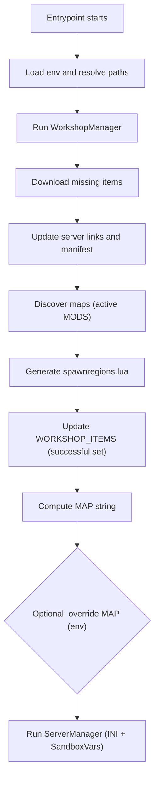

# 🧩 Workshop configuration (mods)

When the container starts and the entrypoint runs, one of the first phases is preparing the server for modding. This includes resolving your selected Workshop items, ensuring they’re downloaded and present on disk, linking them into the server’s own workshop directory, and updating environment variables to reflect the actual set of mods available. Doing this before applying the server configuration guarantees the right mods and maps are in place when the game launches.

Workshop flow (high-level):

---

## 🔌 Where this happens

- Entrypoint: `/scripts/entrypoint.sh` invokes the Python configuration pipeline
- Config orchestrator: `scripts/config/main.py`
- Workshop logic: `scripts/config/workshop_manager.py`

The orchestrator loads environment variables, runs the WorkshopManager first, then updates `WORKSHOP_ITEMS` to the set that actually succeeded before moving on to the general server config (INI + SandboxVars) via the ServerManager.

---

## ⚙️ WorkshopManager responsibilities

At a high level, WorkshopManager ensures the server has the correct set of mods ready to load:

- Read selection from `WORKSHOP_ITEMS` (semicolon-separated Workshop IDs)
- Discover already downloaded items in the Steam workshop content path
- Download missing items one-by-one using SteamCMD (game app id `108600`)
- Synchronize symlinks under the server’s workshop directory so the server “sees” the same content
- Copy the Steam Workshop manifest (`appworkshop_108600.acf`) into the server’s workshop folder (or remove it if no items selected)
- Expose the final, successful list back to the environment so downstream steps only reference valid items

---

## 🧠 WorkshopManager internals

The workshop preparation runs as a small, ordered pipeline before any server configuration is applied. Think of it as: select → discover → fetch → link → map → hand off.

### Selection and inputs

We start with two user inputs: `WORKSHOP_ITEMS` (semicolon‑separated Workshop IDs) and `MODS` (active Mod IDs). Both are read from the environment and normalized—empty fragments and stray spaces are ignored—so the rest of the flow works with a clean selection.

### Discovery and downloads

The Steam Workshop cache is scanned to find items that already exist on disk. Missing items are fetched with SteamCMD (anonymous login), one at a time. Each download’s output is parsed to confirm success or detect errors; failed IDs are pruned so we continue with a truthful set.

### Linking and manifest sync

All downloaded Workshop items live in the Steam cache folder; we don’t copy them. Instead, the server maintains a mirror directory with symlinks only for the selected (active) items—those are the ones the server will actually load at startup. We also mirror the workshop manifest (`appworkshop_<gameId>.acf`) into the server’s workshop root. The server consults this manifest first to decide which items are already on disk; if it’s missing or out of sync, the server assumes nothing is cached and will try to download everything again.

### Maps from active mods

With links in place, only the mods declared in `MODS` are considered “active.” We scan those mods for `media/maps/*`. Each map is recorded once (duplicates are skipped), and when a `spawnpoints.lua` is present its relative path is captured for the next step.

### Spawn regions generation

Whenever a discovered map folder contains a `spawnpoints.lua`, we automatically append an entry for it to your server’s `spawnregions.lua` (generated from the default template and stored alongside your server saves). This adds that map’s spawn points to the in‑game spawn menu so players can spawn there.

### MAP string and overrides

We compose the `MAP` variable automatically from the discovered maps: the names are sorted for stability and joined with semicolons, then `Muldraugh, KY` is appended last. If no maps are discovered, `Muldraugh, KY` is used alone.

Important: some mod combinations may require a specific load order for compatibility. That’s why you can override the generated `MAP` by setting the `MAP` environment variable in your compose file—your order will take precedence when provided.

### Hand‑off to configuration

Once downloads, links, maps, spawn regions, and the `MAP` value are settled (with any override applied), control moves to the general server configuration (INI + SandboxVars). Replacements are applied with confidence that the declared mods and maps actually exist on disk.

---

## 🔖 Identifiers and environment

- WORKSHOP_ITEMS: semicolon-separated list of Workshop IDs selected by you.
- ZOMBOID_GAME_APP_ID: Steam game app id used for downloads (default: 108600).
- ZOMBOID_SERVER_APP_ID: Steam dedicated server app id (default: 380870).
- STEAM_WORKSHOP_DEFAULT_DIR: Root folder where Steam caches Workshop content.
- SERVER_DIR: Root folder of the installed dedicated server inside the container.
- SteamCMD login: performed as anonymous for Workshop downloads.

---

## ✅ Why this ordering matters

- Guarantees mods and maps are present before configuration replacements and startup
- Keeps `WORKSHOP_ITEMS` truthful—only mods that actually exist/downloaded propagate forward
- Streamlines troubleshooting by separating download/linking from config replacement logic

This makes the startup predictable and reduces the chance of mismatch between declared mods and what the server actually loads.
