# 🛠️ Server configuration (INI + SandboxVars)

After the Workshop phase finishes, the configuration stage makes sure your server’s settings are present, valid, and tailored by environment variables. It creates or validates the two key files (the server INI and SandboxVars.lua), optionally applies a preset, and then replaces values using your env variables. Defaults come from the image itself—generated directly from the game at build time—so you always start from a version‑accurate baseline.

Configuration flow (high‑level):

```mermaid
flowchart TD
    A["After Workshop"] --> B["Run ServerManager"]
    B --> C["Decide SandboxVars source (preset? existing? default)"]
    C --> E["Ensure server INI exists (copy default if missing)"]
    E --> F["Use env mapping (incl. MAP) from orchestrator"]
    F --> G["Replace variables in INI"]
    G --> H["Replace variables in SandboxVars"]
    H --> I["Hand-off → start server"]
```



---

## 🔌 Where this happens

- Orchestrator: `scripts/config/main.py` calls the ServerManager after WorkshopManager
- Implementation: `scripts/config/server_manager.py`
- Defaults source: `/defaults/default.ini` and `/defaults/default_SandboxVars.lua` (created at image build)

---

## 📋 Responsibilities

- Validate or create the server INI at `${CACHE_DIR}/Server/${SERVER_NAME}.ini`
- Validate or create the SandboxVars at `${CACHE_DIR}/Server/${SERVER_NAME}_SandboxVars.lua`
- Optionally apply a preset (`SERVER_PRESET`) and enforce it (`FORCE_PRESET=1`)
- Replace variables in both files using your environment variables

---

## 🧠 Internals

### Selection and inputs

The manager receives the full environment mapping built earlier (which can include values computed in the Workshop phase like `MAP`). It also uses a few controller variables for file locations and presets:

- `SERVER_NAME` (default: `servertest`)
- `CACHE_DIR` (default: `/root/Zomboid`)
- `DEFAULTS_DIR` (default: `/defaults`)
- `PRESETS_DIR` (path where custom Sandbox presets live)
- `SERVER_PRESET` (name of a preset file in `PRESETS_DIR`, without extension)
- `FORCE_PRESET` (`1` to force the preset even if a SandboxVars already exists)

### SandboxVars lifecycle

SandboxVars is selected from one of three sources, in this order of intent:

1. Preset selected and available → use `${PRESETS_DIR}/${SERVER_PRESET}.lua`
2. Existing SandboxVars file → use it as the base (unless `FORCE_PRESET=1`)
3. Default template → use `/defaults/default_SandboxVars.lua`

The chosen content is normalized by turning `return` into `SandboxVars =` and then written to `${CACHE_DIR}/Server/${SERVER_NAME}_SandboxVars.lua`.

Edge cases are handled gracefully: a missing preset prints a warning and falls back; forcing a preset overrides an existing SandboxVars as intended.

#### FORCE_PRESET behavior

- `FORCE_PRESET=1` only has effect when `SERVER_PRESET` is set and found.
- When the SandboxVars file already exists and `FORCE_PRESET=1`, the preset fully replaces it; then your environment variables are applied on top.
- When the SandboxVars file does not exist, the preset is used regardless of `FORCE_PRESET` (normal creation path).
- If `SERVER_PRESET` is not set or the preset file is missing, the manager falls back to the default template and logs a warning.

Example (compose):

```yaml
environment:
  - SERVER_PRESET=hardcore
  - FORCE_PRESET=1
  - PVP=true # applied over the preset
  - ZOMBIES=1 # applied over the preset
```

### INI lifecycle

The INI path is `${CACHE_DIR}/Server/${SERVER_NAME}.ini`. If the file is missing, it is created from `/defaults/default.ini`; if it exists, it’s left intact and used as is.

### Variable replacement rules

After both files exist, replacements run against the INI first and then the SandboxVars. Only keys present in your environment are changed; all other lines remain untouched. Matching is case‑insensitive and separator‑agnostic (snake, kebab, camel are all normalized to flatcase before matching). The updater:

- Skips empty lines, comments, and lines with curly braces
- Targets simple `key = value` pairs
- Preserves surrounding formatting (prefixes, separators, trailing commas/comments)
- Writes the new value exactly as provided in the environment

This yields predictable, minimal diffs while letting you fully drive configuration from env vars.

#### Flatcase matching (name it however you like)

Keys are matched using a flatcase convention: names are lowercased and separators are stripped before comparison. This means any naming style you use in the environment will match the corresponding key in the files as long as the letters are the same.

- Examples (all of these map to the same key):
  - `RCON_PASSWORD` → `rconpassword`
  - `rcon-password` → `rconpassword`
  - `RconPassword` → `rconpassword`
  - `rcon password` → `rconpassword`

Practical effect: you don’t need a predefined mapping. If a new version of Project Zomboid introduces a new INI or SandboxVars key, you can set it immediately by passing an environment variable whose flatcase matches that key. The manager will find and replace it without any code changes.

### Hand‑off

On success, the manager logs the updated line counts and returns the paths to the two files. The entrypoint then proceeds to start the server using those effective settings.

---

## 🔖 Identifiers and environment

- `SERVER_NAME`, `CACHE_DIR`, `DEFAULTS_DIR`, `PRESETS_DIR`
- `SERVER_PRESET`, `FORCE_PRESET`
- All other env vars corresponding to INI or Sandbox keys (e.g., `RCON_PASSWORD`, `PVP`, `MAX_PLAYERS`, `ZOMBIES`, `DAY_LENGTH`, `MAP`, etc.)

Note: the `MAP` value may have been auto‑generated in the Workshop stage and optionally overridden by you; by the time replacements run here, its final value is already present in the environment mapping.

---

## ✅ Why this ordering matters

- Files are guaranteed to exist before replacements, avoiding partial or broken updates
- Presets apply first, then your env changes layer on top (and can override preset values)
- Replacing INI before SandboxVars aligns with typical operational edits (server rules, ports, RCON, then world tuning)

This sequence produces stable, easy‑to‑reason results that reflect your intent without manual file edits.
