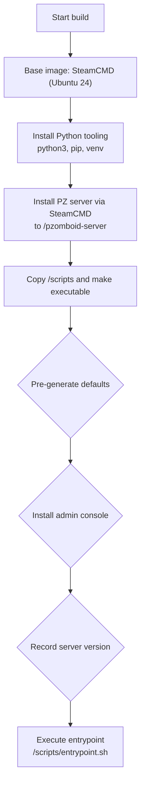

# Image build and defaults

Our image is built to feel “ready out of the box.” It ships with the official SteamCMD runtime, the Project Zomboid dedicated server already installed, Python tooling for configuration, and a small admin toolbox. At build time we pre-generate pristine configuration defaults, bundle an RCON-powered console, and record the exact server version that’s included. The result: faster first boot, predictable behavior, and a smoother day‑to‑day experience.

Build flow (high‑level):

---

## 🧩 Base image (SteamCMD, official)

We start from `ghcr.io/steamcmd/steamcmd:ubuntu-24`, a lean Ubuntu 24 image with SteamCMD preinstalled—ideal for installing and updating dedicated servers. During the build we add:

- `python3`, `python3-pip`, `python3-venv` → used by the startup configuration pipeline and helper scripts

Using SteamCMD, we install the Project Zomboid dedicated server into `/pzomboid-server` (Steam app ID `380870`). We also declare helpful environment variables like `ZOMBOID_SERVER_APP_ID` and `ZOMBOID_GAME_APP_ID` for clarity and future automation.

➡️ Steps (at build time):

- Update packages and install Python tooling: `python3`, `python3-pip`, `python3-venv`
- Prepare the install directory: create `/pzomboid-server`
- Install server with SteamCMD: `+login anonymous +force_install_dir /pzomboid-server +app_update ${ZOMBOID_SERVER_APP_ID} validate +quit`
- Define default locations via ENV: `STEAM_WORKSHOP_DEFAULT_DIR` and `CACHE_DIR`

---

## 🔧 What happens during the build

Once our `scripts/` folder is copied in, the Dockerfile runs a few preparatory tasks that “prime” the image.

### 📦 Default configuration, captured from the game

We briefly launch the server to let it generate its own default files (e.g., `servertest.ini`, `servertest_SandboxVars.lua`) in the cache directory (`/root/Zomboid/Server`). Those files are then moved into `/defaults` and renamed to `default*`. By snapshotting the game’s defaults at build time, we ensure your environment‑based overrides start from a clean, version‑accurate baseline.

Key paths: `/pzomboid-server` (server binaries), `/root/Zomboid` (cache), `/defaults` (templates)

➡️ Steps (generate and stage defaults):

- Make build scripts executable: `chmod -R a+x /scripts`
- Start the server once in the background with `-servername servertest -adminpassword default -cachedir /root/Zomboid`
- Wait (up to ~120s) for `servertest_SandboxVars.lua` to appear under `/root/Zomboid/Server`
- Move all `servertest*` artifacts into `/defaults` as `default*` (e.g., `default.ini`, `default_SandboxVars.lua`)
- Stop the temporary server process cleanly

### 🛠️ Built-in admin console

We install the lightweight `rcon` client (from gorcon) and a friendly wrapper called `admin-console`. With a running container, you can jump into an interactive admin session via:

`docker exec -it <container> admin-console`

No extra setup is required. The CLI version is controlled by `RCON_CLI_VERSION`, and the wrapper is installed to `/usr/local/bin/admin-console`.

➡️ Steps (bundle the console):

- Install minimal fetch tools (e.g., `wget`, CA certificates) for the build stage
- Download the `rcon` release matching `RCON_CLI_VERSION` and extract the binary
- Place `rcon` into `/usr/local/bin` and mark it executable
- Install the wrapper script as `/usr/local/bin/admin-console` and mark it executable
- Clean up temporary files and remove build-only packages

### 🏷️ Server version labeling

To make the image self‑describing, we parse the server console log and write the detected version to `/PZ_VERSION`. If detection fails for any reason, the image records `failed-to-retreive`, making the state explicit. This small label lets tooling (and humans) know what’s inside without launching the game.

➡️ Steps (extract and persist version):

- Read `${CACHE_DIR}/server-console.txt` and find the first `version=…` token
- Extract the numeric value (e.g., `41.78.16`) and print to STDOUT
- Capture the output during the Docker build and write it to `/PZ_VERSION`
- Fall back to `failed-to-retreive` if the log is missing or the token isn’t found

---

## 💾 Volumes baked in

Two volumes are declared to keep data and downloads persistent:

- Workshop cache → `/root/.local/share/Steam/steamapps/workshop`
- Server cache and saves → `/root/Zomboid`

Mount them in your compose file so workshop content and worlds survive container recreation.

---

## ✅ Why this matters

- Faster first run (defaults and tooling are already in place)
- Reproducible configuration (defaults match the bundled server version)
- Ready‑to‑administer (RCON console included)
- Introspectable image (`/PZ_VERSION` makes the contents clear)

This preparation keeps runtime startup lean and makes configuration consistent and reliable across environments.
